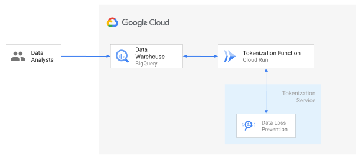

# Use custom encryption in BigQuery using Remote Function, Cloud Run and Data Loss Prevention

*Summary: Learn how to use Remote Functions to de/re-identify data with DLP in BigQuery using SQL.*

[](https://github.com/GoogleCloudPlatform/bigquery-dlp-remote-function/actions/workflows/main.yml)
[](https://codecov.io/gh/GoogleCloudPlatform/bigquery-dlp-remote-function)

This document discusses how to detect and de-identify sensitive data like personally identifiable information (PII) in
BigQuery tables with simple SQL based functions, using Cloud Data Loss Prevention
[(Cloud DLP)](https://cloud.google.com/dlp). De-identification techniques like encryption lets you preserve the utility
of your data for joining or analytics while reducing the risk of handling the data by de-identifying/obfuscating the raw
sensitive identifiers.

Enterprises may have policy or regulatory requirements to only store de-identified data in their DataWarehouses, and a need
to quickly re-identify the de-identify data for reports generation. To minimize the risk of handling large volumes of
sensitive data, you can use an
[automated data transformation pipeline](https://github.com/GoogleCloudPlatform/auto-data-tokenize) to create
de-identified datasets that can be used for migrating from on-premises to cloud. You can use this project to either
replace that pipeline with a SQL query for de-identification and quick re-identification or only for re-identification.

Cloud DLP can inspect the data for sensitive information when the dataset has not been characterized, by using
[more than 100 built-in classifiers](https://cloud.google.com/dlp/docs/infotypes-reference). Using DLP to de-identify the
data requires complex data pipelines/applications. This solution aims to help your data analysts/engineers/scientists
to achieve the same outcome through Simple SQL functions using
BigQuery [Remote Functions](https://cloud.google.com/blog/products/data-analytics/extending-bigquery-functions) which
are a powerful way to extend the functionality of BigQuery.

This document demonstrates a reference implementation of de-identifying structured data in
[BigQuery](https://cloud.google.com/bigquery) using DLP and remote function
(hosted on [Cloud Run](https://cloud.google.com/run)).

This document is intended for audience whose responsibilities include data security, data processing, or data
analytics. This guide assumes that you're familiar with data processing and data privacy, without the need to be an
expert and run simple shell and SQL scripts.

## Objectives

* Deploy Cloud Run service providing DLP based encryption functionality
* Create BigQuery Remote functions that use DLP de-identify templates
* Verify data encryption in BigQuery using a SQL query

## Costs

This tutorial uses billable components of Google Cloud, including the following:

* [BigQuery](https://cloud.google.com/bigquery/pricing)
* [Cloud Build](https://cloud.google.com/build/pricing)
* [Cloud Run](https://cloud.google.com/run/pricing)
* [Cloud Secret Manager](https://cloud.google.com/secret-manager/pricing)
* [Data Loss Prevention](https://cloud.google.com/dlp/pricing)

Use the [pricing calculator](https://cloud.google.com/products/calculator) to generate a cost estimate based on your
projected usage.

## Architecture



## Before you begin

For this tutorial, you need a Google Cloud [project](https://cloud.google.com/resource-manager/docs/cloud-platform-resource-hierarchy#projects). To make
cleanup easiest at the end of the tutorial, we recommend that you create a new project for this tutorial.

1.  [Create a Google Cloud project](https://console.cloud.google.com/projectselector2/home/dashboard).
1.  Make sure that [billing is enabled](https://support.google.com/cloud/answer/6293499#enable-billing) for your Google
    Cloud project.
1.  [Open Cloud Shell](https://console.cloud.google.com/?cloudshell=true).

    At the bottom of the Cloud Console, a [Cloud Shell](https://cloud.google.com/shell/docs/features) session opens and
    displays a command-line prompt. Cloud Shell is a shell environment with the Cloud SDK already installed, including
    the [gcloud](https://cloud.google.com/sdk/gcloud/) command-line tool, and with values already set for your current
    project. It can take a few seconds for the session to initialize.

1.  In Cloud Shell, clone the source repository and go to the directory for this tutorial:

        git clone https://github.com/GoogleCloudPlatform/bigquery-dlp-remote-function.git
        cd bigquery-dlp-remote-function/

2.  Enable all the required Google Cloud APIs

    ```shell
    gcloud services enable \
    artifactregistry.googleapis.com \
    bigquery.googleapis.com \
    bigqueryconnection.googleapis.com \
    cloudbuild.googleapis.com \
    cloudkms.googleapis.com \
    containerregistry.googleapis.com \
    dlp.googleapis.com \
    run.googleapis.com \
    secretmanager.googleapis.com
    ```

## Deployment script

1.  Authenticate using User [Application Default Credentials ("ADCs")](https://cloud.google.com/sdk/gcloud/reference/auth/application-default) as a primary authentication method.
    ```shell
    gcloud auth application-default login
    ```

2.  Initialize and run the Terraform script to create all resources:

    ```shell
    terraform init && \
    terraform apply
    ```

3.  Once the script successfully completes resources creation,
    visit [BigQuery Console](https://console.cloud.google.com/bigquery)
    to run the test SQL script

    ```sql
    SELECT
    pii_column,
    fns.dlp_freetext_encrypt(pii_column) AS dlp_encrypted,
    fns.dlp_freetext_decrypt(fns.dlp_freetext_encrypt(pii_column)) AS dlp_decrypted
    FROM
     UNNEST(
       [
           'My name is John Doe. My email is john@doe.com',
           'Some non PII data',
           '212-233-4532',
           'some script with simple number 1234']) AS pii_column
      ```

      The query will produce a result similar to following table:

      <table>
          <thead>
              <th>Row</th>
              <th>pii_column</th>
              <th>dlp_encrypted</th>
              <th>dlp_decrypted</th>
          </thead>
          <tbody>
              <tr>
                  <td>1</td>
                  <td>My name is John Doe. My email is john@doe.com</td>
                  <td>My name is John Doe. My email is BQ_TRF_EMAIL(40):AQy6lGvwKR+AiiRqJpEr+nBzZUzOcjXkXamUugU=</td>
                  <td>My name is John Doe. My email is john@doe.com</td>
              </tr>
              <tr>
                  <td>2</td>
                  <td>Some non PII data</td>
                  <td>Some non PII data</td>
                  <td>Some non PII data</td>
              </tr>
              <tr>
                  <td>3</td>
                  <td>212-233-4532</td>
                  <td>BQ_TRF_PH(40):AbovCRcD0RwhqTJh1SuQmEfXERQoAmOKxwC2jc8=</td>
                  <td>212-233-4532</td>
              </tr>
              <tr>
                  <td>4</td>
                  <td>some script with simple number 1234</td>
                  <td>some script with simple number 1234</td>
                  <td>some script with simple number 1234</td>
              </tr>
          </tbody>
      </table>

## Detailed Deployment steps

In case you want to customize the deployment, please use following steps:

### Setting up your environment

1.  Enable APIs for Compute Engine, Cloud Storage, Dataproc, and Cloud SQL services:

    ```shell
    gcloud services enable --project "${PROJECT_ID}" \
    artifactregistry.googleapis.com \
    bigquery.googleapis.com \
    bigqueryconnection.googleapis.com \
    cloudbuild.googleapis.com \
    cloudkms.googleapis.com \
    containerregistry.googleapis.com \
    dlp.googleapis.com \
    iam.googleapis.com \
    run.googleapis.com \
    secretmanager.googleapis.com
    ```

1.  In Cloud Shell, set the [Cloud Region](https://cloud.google.com/compute/docs/regions-zones#available) that you want to create your BigQuery and Cloud Run resources in:

    ```shell
    PROJECT_ID="<PROJECT_ID>"
    REGION="<REGION_ID>"
    ARTIFACT_REGISTRY_NAME="<ARTIFACT_DOCKER_REGISTRY_NAME>"
    CLOUD_RUN_SERVICE_NAME="bq-transform-fns"
    ```

### Create Service Account for Cloud Run service

For fine-grained access control, using a specialized service account for
individual services is recommended.

1.  Create a service Account:

    ```shell
    RUNNER_SA_NAME="${CLOUD_RUN_SERVICE_NAME}-runner"
    RUNNER_SA_EMAIL="${RUNNER_SA_NAME}@${PROJECT_ID}.iam.gserviceaccount.com"

    gcloud iam service-accounts create "${RUNNER_SA_NAME}" \
    --project="${PROJECT_ID}" \
    --description "Runner for BigQuery remote function execution" \
    --display-name "${RUNNER_SA_NAME}"
    ```

1.  Grant permissions to the service account to access DLP

    ```shell
    gcloud projects add-iam-policy-binding "${PROJECT_ID}" \
    --member="serviceAccount:${RUNNER_SA_EMAIL}" \
    --role='roles/dlp.deidentifyTemplatesReader'

    gcloud projects add-iam-policy-binding "${PROJECT_ID}" \
    --member="serviceAccount:${RUNNER_SA_EMAIL}" \
    --role='roles/dlp.user'
    ```

### Create Artifact Registry
This is a containerized SpringBoot application.
Create an [Artifact Registry](https://cloud.google.com/artifact-registry) to store the application's container image

```shell
gcloud artifacts repositories create "${ARTIFACT_REGISTRY_NAME}" \
--repository-format=docker \
--location="${REGION}" \
--description="Docker repository for Bigquery Functions" \
--project="${PROJECT_ID}"
```

### Deploy Cloud Run service

1. Build the application container image using [Cloud Build](https://cloud.google.com/build):
    ```shell
    gcloud builds submit . \
    --project="${PROJECT_ID}" \
    --substitutions=_CONTAINER_IMAGE_NAME="${REGION}-docker.pkg.dev/${PROJECT_ID}/${ARTIFACT_REGISTRY_NAME}/${CLOUD_RUN_SERVICE_NAME}:latest" \
    --machine-type=e2-highcpu-8
    ```

2. Deploy Cloud Run by compiling and deploying Container :

    ```shell
    gcloud beta run deploy ${CLOUD_RUN_SERVICE_NAME} \
    --image="${REGION}-docker.pkg.dev/${PROJECT_ID}/${ARTIFACT_REGISTRY_NAME}/${CLOUD_RUN_SERVICE_NAME}:latest" \
    --execution-environment=gen2 \
    --platform=managed \
    --region="${REGION}" \
    --service-account="${RUNNER_SA_EMAIL}" \
    --update-env-vars=PROJECT_ID=${PROJECT_ID} \
    --no-allow-unauthenticated \
    --project ${PROJECT_ID}
    ```

1.  Retrieve and save the Cloud Run URL:

    ```shell
    RUN_URL="$(gcloud run services describe ${CLOUD_RUN_SERVICE_NAME} --region ${REGION} --project ${PROJECT_ID} --format="get(status.address.url)")"
    ```

### Create DLP Didentify Templates

DLP [Deidentify templates](https://cloud.google.com/dlp/docs/creating-templates-deid) makes managing deidentification and inspection easy to document and manage.

```shell
DEID_TEMPLATE=$(curl -X POST \
-H "Authorization: Bearer `gcloud auth print-access-token`" \
-H "Accept: application/json" \
-H "Content-Type: application/json" \
-H "X-Goog-User-Project: ${PROJECT_ID}" \
--data-binary "@sample_dlp_deid_config.json" \
"https://dlp.googleapis.com/v2/projects/${PROJECT_ID}/locations/${REGION}/deidentifyTemplates")

DEID_TEMPLATE_NAME=$(echo ${DEID_TEMPLATE} | jq -r '.name')
```

> **Note:** Recommended practice is to use
> [KMS Wrapped Key for DLP de-identification](https://cloud.google.com/dlp/docs/create-wrapped-key).
>
> This document uses unwrapped key for simplification of demo purpose.

### Create BigQuery Remote Functions

1.  Create BigQuery connection for accessing Cloud Run:

    ```shell
    bq mk --connection \
    --display_name='External transform function connection' \
    --connection_type=CLOUD_RESOURCE \
    --project_id="${PROJECT_ID}" \
    --location="${REGION}" \
    ext-${CLOUD_RUN_SERVICE_NAME}
    ```

1.  Find the BigQuery Service Account used for the connection:

    ```shell
    CONNECTION_SA="$(bq --project_id ${PROJECT_ID} --format json show --connection ${PROJECT_ID}.${REGION}.ext-${CLOUD_RUN_SERVICE_NAME} | jq '.cloudResource.serviceAccountId')"
    ```

1.  Grant the BigQuery connection Service Account Cloud Run Invoker role for accessing the Cloud Run:

    ```shell
    gcloud projects add-iam-policy-binding ${PROJECT_ID} \
    --member="serviceAccount:${CONNECTION_SA}" \
    --role='roles/run.invoker'
    ```

### Create BQ Dataset for remote functions

1.  Define the BigQuery dataset to create remote functions:

    ```shell
    BQ_FUNCTION_DATASET="fns"
    ```

1.  Create the dataset if it doesn't exist:

    ```shell
    bq mk --dataset \
    --project_id ${PROJECT_ID} \
    --location ${REGION} \
    ${BQ_FUNCTION_DATASET}
    ```

### Create BigQuery Remote functions for DLP

1.  Create DLP de-identification function:

    DLP uses default inspection template, if you want to use your custom [Inspection template](https://cloud.google.com/dlp/docs/concepts-templates#the_inspecttemplate_and_deidentifytemplate_objects),
    please add following to the `user_defined_context`: `('dlp-inspect-template', '<full inspection template name>')`

    ```shell
    bq query --project_id ${PROJECT_ID} \
    --use_legacy_sql=false \
    "CREATE OR REPLACE FUNCTION ${BQ_FUNCTION_DATASET}.dlp_freetext_encrypt(v STRING)
    RETURNS STRING
    REMOTE WITH CONNECTION \`${PROJECT_ID}.${REGION}.ext-${CLOUD_RUN_SERVICE_NAME}\`
    OPTIONS (endpoint = '${RUN_URL}', user_defined_context = [('mode', 'deidentify'),('algo','dlp'),('dlp-deid-template','${DEID_TEMPLATE_NAME}')]);"
    ```

1.  Create DLP re-identification function:

    DLP uses default inspection template, if you want to use your custom [Inspection template](https://cloud.google.com/dlp/docs/concepts-templates#the_inspecttemplate_and_deidentifytemplate_objects),
    please add following to the `user_defined_context`: `('dlp-inspect-template', '<full inspection template name>')`

    ```shell
    bq query --project_id ${PROJECT_ID} \
    --use_legacy_sql=false \
    "CREATE OR REPLACE FUNCTION ${BQ_FUNCTION_DATASET}.dlp_freetext_decrypt(v STRING)
    RETURNS STRING
    REMOTE WITH CONNECTION \`${PROJECT_ID}.${REGION}.ext-${CLOUD_RUN_SERVICE_NAME}\`
    OPTIONS (endpoint = '${RUN_URL}', user_defined_context = [('mode', 'reidentify'),('algo','dlp'),('dlp-deid-template','${DEID_TEMPLATE_NAME}')]);"
    ```


## Verify De-identification and Re-identification

Execute the following query to observe that the remote function is deidentifying
and reidentifying the data using SQL:

1.  Using [BigQuery Workspace](https://console.cloud.google.com/bigquery)

    ```sql
    SELECT
        pii_column,
        fns.dlp_freetext_encrypt(pii_column) AS dlp_encrypted,
        fns.dlp_freetext_decrypt(fns.dlp_freetext_encrypt(pii_column)) AS dlp_decrypted
    FROM
        UNNEST(
        [
            'My name is John Doe. My email is john@doe.com',
            'Some non PII data',
            '212-233-4532',
            'some script with simple number 1234']) AS pii_column
    ```

1.  Using Cloud Shell run the following command to run the query on BigQuery:

    ```shell
    bq query --project_id ${PROJECT_ID} \
    --use_legacy_sql=false \
    "
    SELECT
      pii_column,
      ${BQ_FUNCTION_DATASET}.dlp_freetext_encrypt(pii_column) AS dlp_encrypted,
      ${BQ_FUNCTION_DATASET}.dlp_freetext_decrypt(${BQ_FUNCTION_DATASET}.dlp_freetext_encrypt(pii_column)) AS dlp_decrypted
    FROM
      UNNEST(
        [
          'My name is John Doe. My email is john@doe.com',
          'Some non PII data'
        ]) AS pii_column"
    ```

    Expected Output:


    |  pii_column  |  dlp_encrypted  | dlp_decrypted | aes_encrypted  |  aes_decrypted  |
    | -----------  | -----------  | ----------- | -----------  | -----------  |
    | My name is John Doe. My email is john@doe.com | My name is John Doe. My email is BQ_TOK_FN(40):AQy6lGvwKR+AiiRqJpEr+nBzZUzOcjXkXamUugU= | My name is John Doe. My email is john@doe.com | qWnwDEY3bDTCV/azveHnxUm24z/DvUcVLZWHyN4Rg16ISvqswcuYXNXsOyI4/d8M | My name is John Doe. My email is john@doe.com |
    | Some non PII data                              | Some non PII data                                                                       | Some non PII data                                                | 37Agm90CqzGXwerJxai/Tf89ffRN9FpPkuuDW+rz7ns=                     | Some non PII data                             |

## Limitations

 *  The de-identification and re-identification processing occurs through a Cloud Run service.
    Please provision the Cloud Run CPU/Memory in accordance with your compute requirements
 *  When using DLP consider following:
    *  Use at least `--cpu=4 --memory=8Gi` for Cloud Run instance
    *  When using DLP consider following limits for throughput and cost considerations:
    *  Limit to 10000 or fewer items for DLP processing
 *  Ensure BigQuery, Cloud Run service and DLP templates are in the same cloud region

## Cleaning up

<div style="color: lightcoral">
<b>Caution:</b> Deleting a project has the following effects:
<ul style="color: lightcoral">
    <li> Everything in the project is deleted. If you used an existing project for this tutorial, when you delete it, you also delete any other work you've done in the project. </li>
    <li> Custom project IDs are lost. When you created this project, you might have created a custom project ID that you want to use in the future. To preserve the URLs that use the project ID, such as an appspot.com URL, delete selected resources inside the project instead of deleting the whole project. </li>
</ul>
If you plan to explore multiple tutorials and quickstarts, reusing projects can help you avoid exceeding project quota limits.
</div>

To avoid incurring charges to your Google Cloud account for the resources used in this tutorial, you can delete the project:

1.  In the Cloud Console, go to the [**Manage resources** page](https://console.cloud.google.com/iam-admin/projects).
1.  In the project list, select the project that you want to delete and then click **Delete** .
1.  In the dialog, type the project ID and then click **Shut down** to delete the project.


## What's next

* Learn more about [BigQuery Remote Functions](https://cloud.google.com/bigquery/docs/reference/standard-sql/remote-functions)
* Learn more about [Cloud DLP](https://cloud.google.com/dlp)
* Learn more about [Cloud KMS](https://cloud.google.com/kms)
* Learn about [Inspecting storage and databases for sensitive data](https://cloud.google.com/dlp/docs/inspecting-storage)
* Handling [De-identification and re-identification of PII in large-scale datasets using DLP](https://cloud.google.com/solutions/de-identification-re-identification-pii-using-cloud-dlp)

## Disclaimer
**License**: Apache 2.0

This is not an official Google product.
